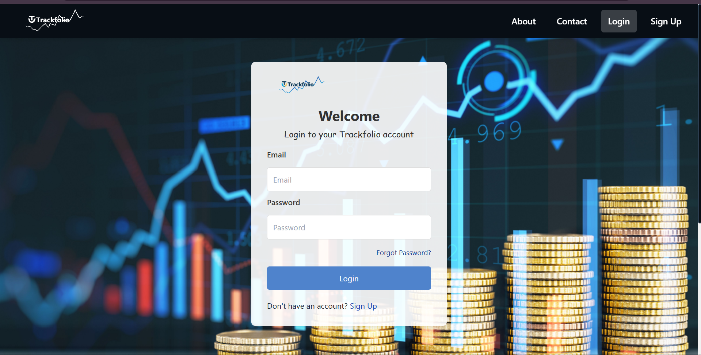
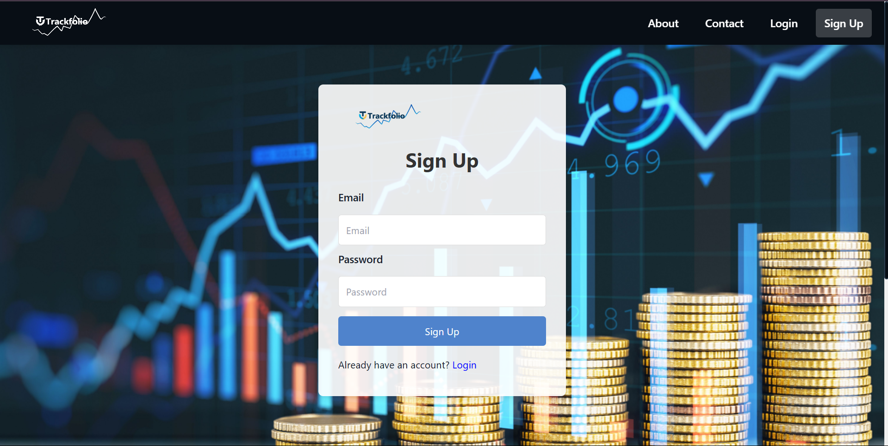
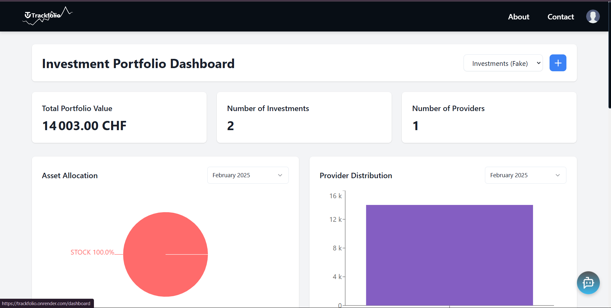
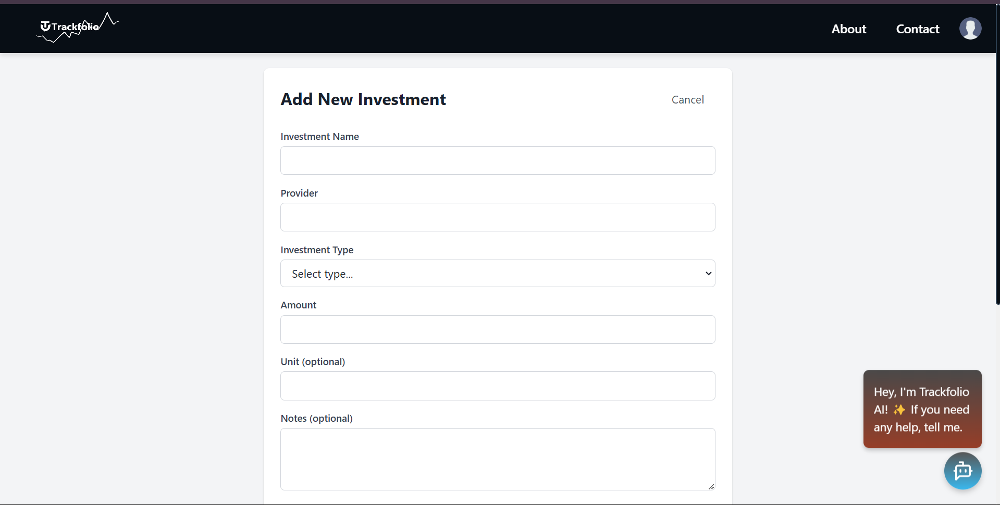
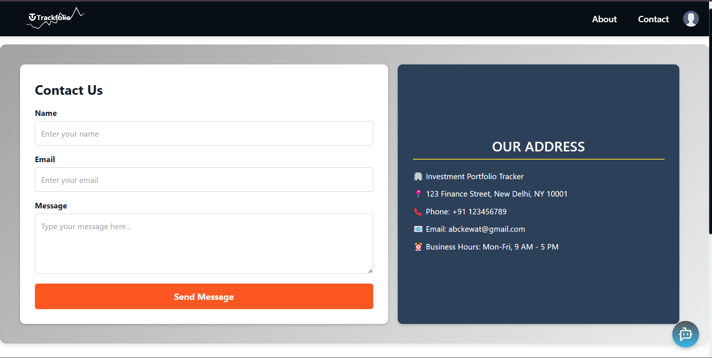

# B42_WEB_066_The-Pixel-Wizards

## Introduction

With the growing popularity of stocks, cryptocurrencies, and other asset types, investors need a user-friendly tool to track and manage their investments. A portfolio tracker provides an overview of their holdings and helps them make informed decisions by presenting real-time data and performance analytics.

A sleek and responsive investment portfolio tracker where users can add and manage various assets (stocks, crypto, etc.), and view real-time performance data in an intuitive dashboard.

## Project Type

Fullstack (MERN Stack)

## Deplolyed App

Frontend: [Trackfolio - Live App](https://trackfolio.onrender.com/)

Backend: [Trackfolio API](https://trackfolio-backend.onrender.com/)

## Directory Structure

    Trackfolio/
    ├─ client/  # React.js Frontend
    │  ├─ src/
    │  │  ├─ components/
    │  │  ├─ pages/
    │  │  ├─ utils/
    │  │  ├─ services/
    │  ├─ public/
    ├─ server/   # Node.js & Express.js Backend
    │  ├─ models/
    │  ├─ routes/
    │  ├─ controllers/
    │  ├─ middleware/
    │  ├─ config/


## Video Walkthrough of the project
[🎥 Project Walkthrough – Click to Watch! 👇🔥](https://drive.google.com/file/d/1dqpRbYsw2iNgG8-30-3s8EIFRAF3mHdM/view?usp=drive_link)

## Video Walkthrough of the codebase
Attach a very short video walkthough of codebase [ 1 - 5 minutes ]

## Features
List out the key features of your application.

- ✅ User Authentication – Secure login & signup with JWT authentication.
- ✅ Portfolio Overview Dashboard – View all assets with real-time value updates.
- ✅ Interactive Charts & Graphs – Visualize performance trends using Recharts.
- ✅ Asset Management – Add, remove, and update investments.
- ✅ Filtering & Sorting – Organize assets by performance, type, and value.
- ✅ Responsive UI – Optimized for desktop & mobile users.

## design decisions or assumptions

- **Real-time Data Handling:** Used external APIs like CoinGecko/Alpha Vantage to fetch live asset prices.
- **Performance Optimization:** Cached API responses to reduce excessive API calls.
- **Scalability:** Backend designed with modular routes & controllers for easy expansion.
- **Authentication:** JWT-based authentication to ensure secure user sessions.
- **Frontend UI:** Built with React, Tailwind CSS, and Chakra UI for a modern, responsive experience.

## Installation & Getting started
Follow these steps to run the project locally:

### 1. Clone the repository

```bash
git clone https://github.com/Abhi-5174/Trackfolio.git
cd Trackfolio
```
### 2. Setup Frontend

```bash
cd client
npm install
npm run dev
```
*Frontend will be available at http://localhost:5173*

### 3. Setup Backend
```bash
cd server
npm install
npm run start
```
*Backend will run on http://localhost:5000*

## Usage

- **Sign up or log** in to access your portfolio.
- **Add investments** like stocks, crypto, or other assets.
- **View real-time performance** through graphs and charts.
- **Compare assets** side-by-side using the performance comparison tool.
- **Filter and sort investments** based on criteria like performance or asset type.













## Credentials

For testing authenticated pages, use the following:

**Test User:**

- **Email:** abckewat@gmail.com
- **Password:** 123

*(You can also register a new account)*

## API Endpoints

### Authentication Routes
- POST /auth-verify – For verifying user.
- POST /login – Authenticate and get JWT token.
- POST /signup – Authenticate and get Add user account.
- POST /forgot-password – For sending reset-password link.
- POST /reset-password – For verifying and resetting user's password.
- POST /about – For About Us page.
- POST /contact – For Contact Us page.

### Portfolio Management
- GET /api/investments/:tableName – Retrieve user investments.
- POST /api/investments/:tableName/ – Add an asset.
- DELETE /api/investments/:tableName/:id – Remove an asset.
- PUT /api/investments/:tableName/:id – Update asset holdings.


## Technology Stack

### Frontend 🖥️

- **React.js** – Frontend framework.
- **Tailwind CSS & Chakra UI** – UI components & styling.
- **Recharts** – Data visualization (charts, graphs).
- **Axios** – API requests.
- **React Router** – Navigation & protected routes.

### Backend ⚙️

- **Node.js & Express.js** – Server-side API.
- **MongoDB & Mongoose** – Database & schema management.
- **JWT Authentication** – Secure user authentication.

### Deployment 🚀

- **Frontend:** Hosted on Render.
- **Backend:** Hosted on Render.
- **Database:** MongoDB Atlas (Cloud).